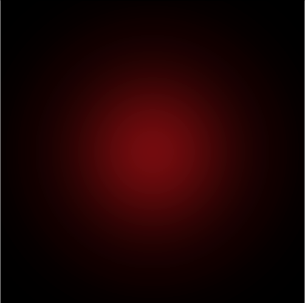

# GaussianRenderer
Built a renderer that can visualize Gaussians.

<figure style="display: flex; justify-content: center; gap: 2%; align-items: center;">
  
  
</figure>

## Timeline:
1. Software Rasterizer: Render a Single Gaussian built through the CPU. ✅
2. Extended Software Rasterizer: Extend to render a scene with multiple gaussians through the CPU.
3. GPU Rasterizer: Extend with shaders for Gaussian splatting on the GPU.
4. WebGPU Rasterizer: Extend to run in real-time on the Web using GPU.
5. Bonus: Extend to Render Radiance Fields through CPU.
